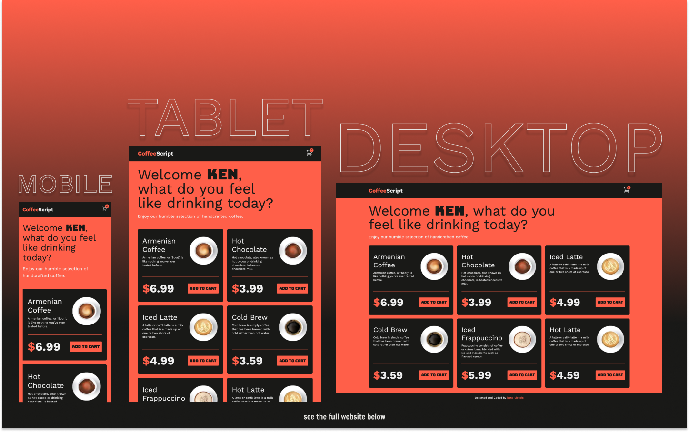

# Tapply Coding Challenge: Frontend

## Table of contents

- [Overview](#overview)
  - [Screenshot](#screenshot)
  - [Links](#links)
  - [About Us](#about-us)
- [My process](#my-process)
  - [Built With](#built-with)
- [Author's Links](#authors-links)

## Overview

### Screenshot

### Links

- Live Site URL: [https://challenge-frontend-sigma.vercel.app/](https://challenge-frontend-sigma.vercel.app/)

### About Us

CoffeeScript is a humble local coffee shop founded in 2022 by a front-end developer named Ken. The selection of coffee may not be very large, but the website is just cool, and that's what drives most of the customers to our coffee shop. Upon entering the website, users are asked to provide their name, to personalize their experience. After that, users can select as many of our delicious coffees, as their body can handle. Checkout is pretty fast and simple, we don't even need you to add card information, we already have it all, and please don't ask from where. We are going to let you experience the checkout by yourself, we hope you like our coffee and our website. Have a nice day and coffee 👨🏻‍💻 ☕️

## My process

### Built with

 

## Author's Links

- LinkedIn - [Karo Nersisyan](https://www.linkedin.com/in/karo-nersisyan-135118129/)
- Medium - [@kens_visuals](https://medium.com/@kens_visuals)
- CodePen - [@kens-visuals](https://codepen.io/kens-visuals)
- Codewars - [@kens_visuals](https://www.codewars.com/users/kens_visuals)
- Frontend Mentor - [@kens-visuals](https://www.frontendmentor.io/profile/kens-visuals)

`<Tapply team='Engineering' />`
